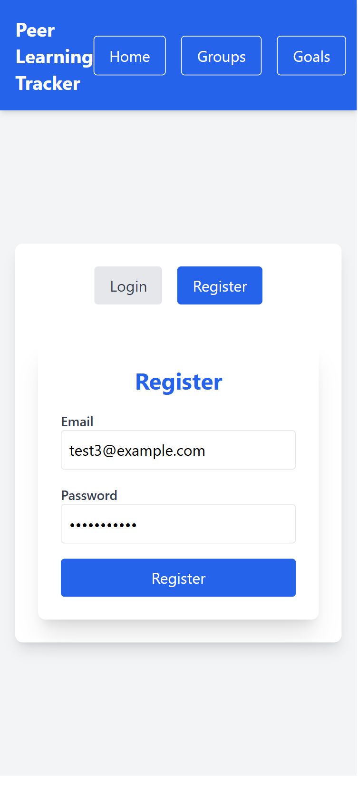
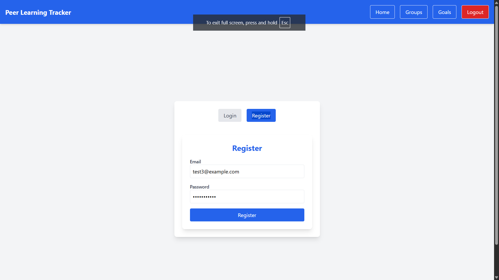
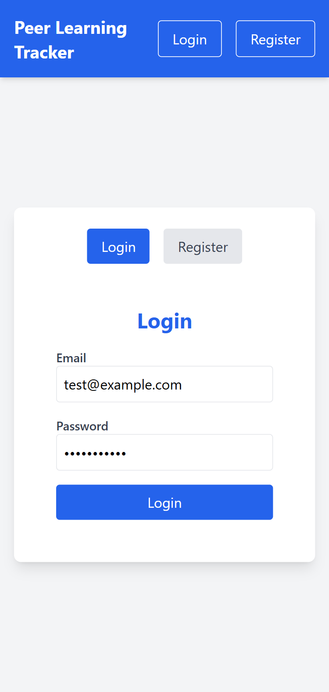
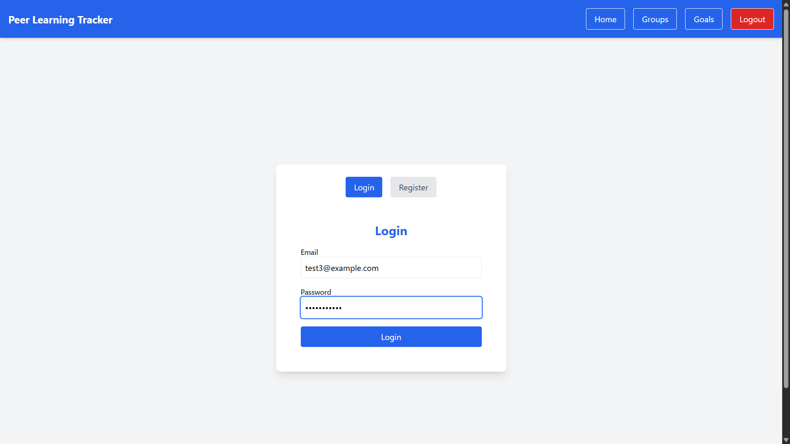
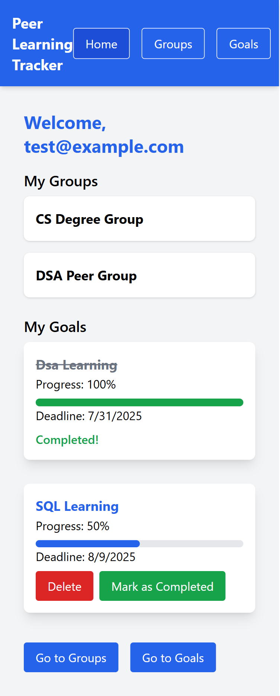
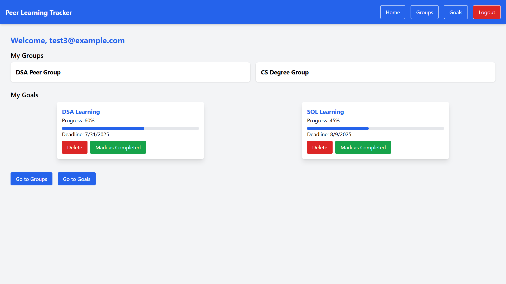
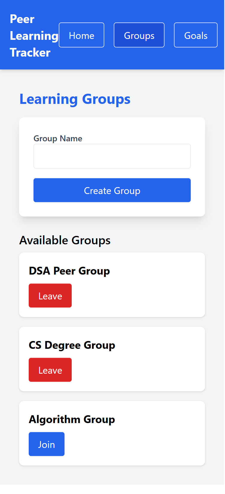
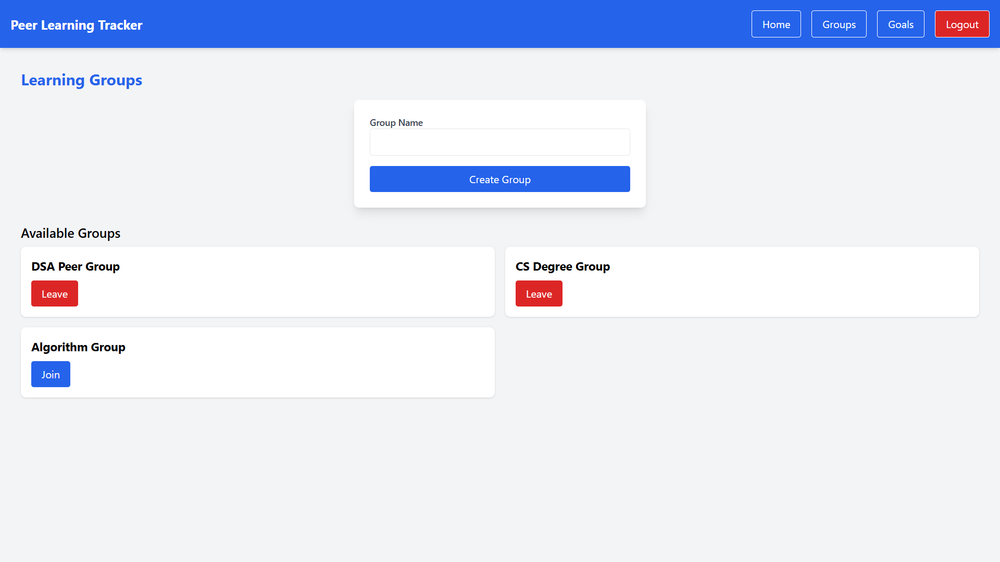
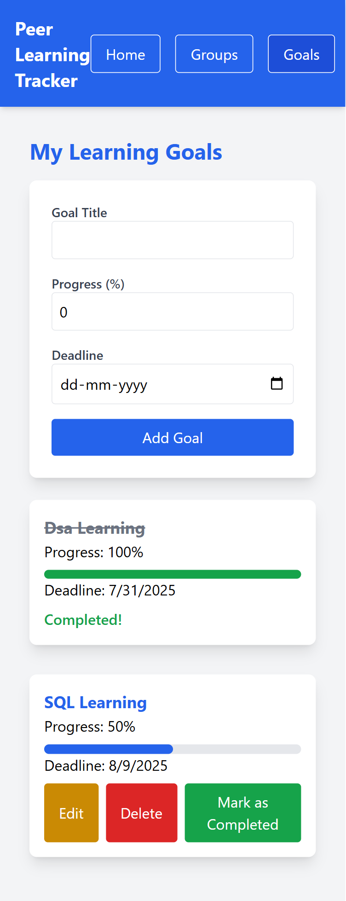
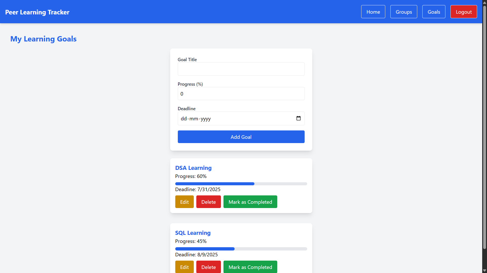

# Peer Learning Tracker Lite

A minimal full-stack web app for users to join learning groups and track their learning goals.

## Tech Stack
- **Frontend**: React (Vite), Tailwind CSS, React Context, react-toastify
- **Backend**: Node.js, Express, MongoDB
- **Auth**: JWT
- **Deployment**: Vercel (frontend), Render (backend) [Yet to be completed]

## Setup Instructions

### 1. Clone the repository
```bash
git clone <repo-url>
```

### 2. Backend Setup
- Navigate to `server`:
  ```bash
  cd server
  npm install
  ```

- Create a `.env` file (see `.env.example`):
  ```env
  MONGO_URI=mongodb://localhost:27017/peer-learning-tracker
  JWT_SECRET=your-secret-key-123
  PORT=5000
  ```

- Start the backend:
  ```bash
  npm run dev
  ```

### 3. Frontend Setup
- Navigate to `client`:
  ```bash
  cd client
  npm install
  ```

- Create a `.env` file (see `.env.example`):
  ```env
  VITE_API_URL=http://localhost:5000
  ```

- Start the frontend:
  ```bash
  npm run dev
  ```

### 4. MongoDB
- Ensure MongoDB is running locally or use MongoDB Atlas.
- Update `MONGO_URI` in `server/.env`.

## API Endpoints

### Auth
- `POST /api/auth/register`: Register a user.
- `POST /api/auth/login`: Login and get JWT.
- `GET /api/users/me`: Get authenticated user’s data (including groups).

### Groups
- `GET /api/groups`: List all groups (protected).
- `POST /api/groups`: Create a new group.
- `POST /api/groups/join/:groupId`: Join a group.
- `POST /api/groups/leave/:groupId`: Leave a group.

### Goals
- `POST /api/goals`: Create a goal.
- `GET /api/goals`: List user’s goals.
- `PUT /api/goals/:id`: Update a goal.
- `DELETE /api/goals/:id`: Delete a goal.
- `PUT /api/goals/:id/complete`: Mark a goal as completed.

## Screenshots
- Auth Register Page (Mobile): 
- Auth Register Page (Desktop): 
- Auth Login Page (Mobile): 
- Auth Login Page (Desktop): 
- Home Page (Mobile): 
- Home Page (Desktop): 
- Groups Page (Mobile): 
- Groups Page (Desktop): 
- Goals Page (Mobile): 
- Goals Page (Desktop): 
